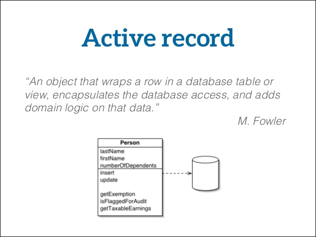

# Active Entity Overview



This class allows you to implement the [Active Record](https://en.wikipedia.org/wiki/Active\_record\_pattern) pattern in your ORM entities by inheriting from our Active Entity class. This will make your ORM entities get all the functionality of our Virtual and Base ORM services so you can do finds, searches, listings, counts, execute queries, transaction safe deletes, saves, updates, criteria building, and even [validation](validation.md) right from within your ORM Entity.&#x20;

The idea behind the Active Entity is to allow you to have a very nice abstraction to all the ColdFusion ORM capabilities (hibernate) and all of our ORM extensions like our ColdBox Criteria Builder. With Active Entity you will be able to:

* Find entities using a variety of filters and conditions
* ORM paging
* Specify order, searches, criterias and grouping of orm listing and searches
* Use DLM style hibernate operations for multiple entity deletion, saving, and updating
* Check for existence of records
* Check for counts using criterias
* Use our extensive ColdBox Criteria Builder to build Object Oriented HQL queries
* Validate your entity using [cbValidation](http://forgebox.io/view/cbValidation)

## Configuration

To work with Active Entity you must do a few things to tell ColdBox and Hibernate you want to use Active Entity:

1. Enable the ORM in your `Application.cfc` with event handling turned on, manage session and flush at request end as **false**.  This will allow Hibernate to talk to the cborm event handling objects.
2. Enable the orm configuration structure in your ColdBox configuration to allow for ColdBox to do entity injections via WireBox.

### Application.cfc

The following are vanilla configurations for enabling the ORM in ColdFusion:


```javascript
component{

    // Enable ORM
    this.ormEnabled       = true;
    // ORM Datasource
    this.datasource          = "contacts";
    // ORM configuration settings
    this.ormSettings      = {
        // Location of your entities, default is your convention model folder
        cfclocation = [ "models" ],
        // Choose if you want ORM to create the database for you or not?
        dbcreate = "update",
        // Log SQL or not
        logSQL = true,
        // Don't flush at end of requests, let Active Entity manage it for you
        flushAtRequestEnd = false,
        // Don't manage session, let Active Entity manage it for you
        autoManageSession = false,
        // Active ORM events
        eventHandling       =  true,
        // Use the ColdBox WireBox Handler for events
        eventHandler = "cborm.models.EventHandler"
    };
}
```


### Module Settings

Open your `config/ColdBox.cfc` and either un-comment or add the following settings:


```javascript
moduleSettings = {
    cborm = {
        injection = {
            // enable entity injection via WireBox
            enabled = true, 
            // Which entities to include in DI ONLY, if empty include all entities
            include = "", 
            // Which entities to exclude from DI, if empty, none are excluded
            exclude = ""
        }
    }
}
```


This enables WireBox dependency injection, which we need for `ActiveEntity` to work with validation and other features.  Check out our [installation](../getting-started/installation.md#module-settings) section if you need a refresher.

## Building Entities

Once your configuration is done we can now focus on building out your Active Entities.  You will do so by creating your entities like normal ORM objects but with two additions:\


1. They will inherit from our base class: `cborm.models.ActiveEntity`
2. If you have a constructor then it must delegate to the super class via `super.init()`



```javascript
component persistent="true" table="users" extends="cborm.models.ActiveEntity"{
    
    property name="id" column="user_id" fieldType="id" generator="uuid";
	property name="firstName";
	property name="lastName";
	property name="userName";
	property name="password";
	property name="lastLogin" ormtype="date";
	
	function init(){
	   return super.init();
	}

}
```



Please remember that your entities inherit all the functionality of the base and virtual services.  Except no entity names or datasources are passed around.

