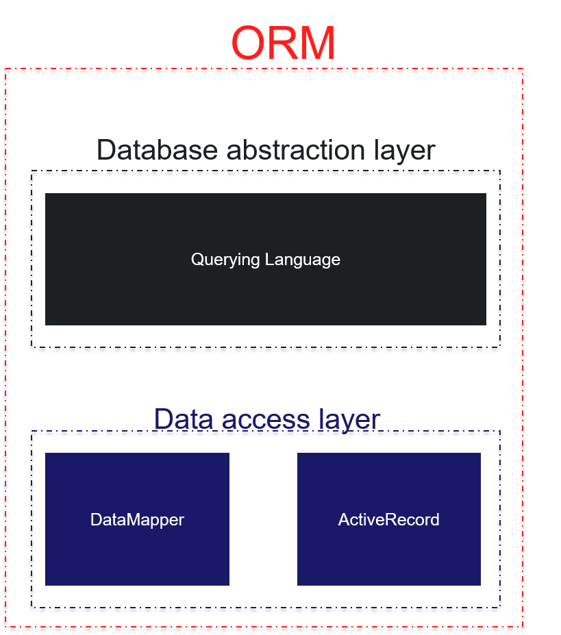

# Overview

The `cborm` module will enhance your ORM Entities and ColdBox application by providing you with features in the following areas:

* Active Record Pattern
  * You can extend your entities from our `ActiveEntity` class and take advantage of both [Active Record](https://en.wikipedia.org/wiki/Active_record_pattern) and Hibernate ORM
* Entity Population
  * Easily populate entities from json, structs, xml, queries and build up even the entity relationships from flat data.
* Entity Marshalling to raw data types \([mementifier](https://forgebox.io/view/mementifier)\)
  * Easily extract the data from entities and their relationships so you can marshall them to json, xml, etc.
* ORM Events
  * Easily listen to multiple ORM events via ColdBox Interceptors
* Service Layers
  * Enhance the ability to list, query, find entities, work with native hibernate constructs and more.
* Validation
  * We provide you with a `unique` validator to validate against unique columns

Just write your entities and their relationships and we will take care of the rest!



## Base ORM Service

Let's begin our adventure with the `BaseORMService` model. This model can be injected or requested via WireBox and will be used to interact with any entity in our system or with Hibernate directly:

```java
// inject via dsl
property name="ormService" inject="entityService";
// inject via alias
property name="ormService" inject="baseORMService@cborm";

// use via alias
getInstance( "BaseORMService@cborm" );
// use via dsl
getInstance( dsl="entityService" );

```

This service object acts as an abstraction layer to the ColdFusion ORM \(Hibernate\) and can work with any entity in your system as all methods most likely receive the `entityName` argument.  You will be able to do the following category of actions from this service class:

* Session utility methods
* Entity metadata methods
* Querying methods
* Criteria Queries or fluent SQL
* Getters
* Finders
* Dynamic Finders
* Counters
* Dynamic Counters
* Persistence \(save,update,delete\) and bulk persistence with transactions
* Eviction Methods
* Population Methods

This means that you don't need to create a service layer CFC in order to work with ORM entities, you can leverage this abstraction to work with your ORM needs.  You can also specifically bind \(root\) the service to a specific entity, which we lovingly call a `VirtualEntityService`. This way you don't have to be passing the entity names left and right, the virtual entity service will be constructed with the name and all operations will be done upon that entity.

### Example

Once you have access to the injected base ORM service, you can use it in all of its glory.

> **Important** Please check out the latest API Docs for the latest methods and functionality: [https://apidocs.ortussolutions.com/\#/coldbox-modules/cborm/](https://apidocs.ortussolutions.com/#/coldbox-modules/cborm/)

```javascript
component{

    inject name="ormService" inject="entityService";

    function saveUser( event, rc, prc ){
        // retrieve and populate a new user object
        var user = populateModel( ormService.new( "User" ) );

        // save the entity using hibernate transactions
        ormService.save( user );

        relocate( "user.list" );
    }

    function list( event, rc, prc ){

        // get a listing of all users with pagination and filtering
        prc.users = ormService.list(
            entityName = "User",
            criteria   = { isActive : true },
            sortOrder  = "fname",
            offset     = event.getValue( "startrow", 1 ),
            max         = 20
        );

        event.setView( "user/list" );
    }

    // Dynamic Finders
    function findUsers( event, rc, prc ){
        prc.data = ormService.findByRoleAndIsActive( "User", "Admin", true );
    }

    // Fluent Criteria Queries
    function searchContent( event, rc, prc ){
        prc.dataStream = ormService
            .newCriteria( "Content" )
                .isEq( "published", rc.isPublished  )
                .isLt( "publishedDate", now() )
                .or( 
                    ormService.getRestrictions().isNull( "expireDate" ), 
                    ormService.getRestrictions().isGT( "expireDate", now() ) 
                )
                .isEq( "passwordProtection", "" )
                .joinTo( "activeContent", "ac" )
                    .like( "title", "%#rc.searchTerm#%" )
            .asStream()
            .list( offset=rc.offset, max=50 );
        
        event.setView( "content/search")
    }
    
}
```

## Virtual Services

We also have a virtual service layer that can be mapped to specific entities and create entity driven service layers **virtually**. Meaning you don't have to be passing any entity names to the API methods to save you precious typing time. This is achived via the `VirtualEntityService` model which inherits from the `BaseORMService` class.

You can achieve this in several manners:

* Injection 
  * `entityService:{EntityName}`
* Request via WireBox using the DSL argument of `getInstance()`
  * `getInstance( dsl = entityService:{EntityName} );`
* Request via a Base ORM Service
  * `createService()`

```java
// Injection
property name="userService" inject="entityService:User"

// Request it
contentService = getInstance( dsl = "entityService:Content" );

// Via ORM Service
ormService.createService( entityName="Content", useQueryCaching=true );
```

That's it!  You can use it just like the BaseORMService except no more passing the entity name.

### Example

```java
component{

    inject name="userService" inject="entityService:User";

    function saveUser( event, rc, prc ){
        // retrieve and populate a new user object
        var user = populateModel( userService.new() );

        // save the entity using hibernate transactions
        userService.save( user );

        relocate( "user.list" );
    }

    function list( event, rc, prc ){

        // get a listing of all users with pagination and filtering
        prc.users = userService.list(
            criteria   = { isActive : true },
            sortOrder  = "fname",
            offset     = event.getValue( "startrow", 1 ),
            max         = 20
        );

        event.setView( "user/list" );
    }

    // Dynamic Finders
    function findUsers( event, rc, prc ){
        prc.data = userService.findByRoleAndIsActive( "Admin", true );
    }

    // Criteria Queries
    function searchContent( event, rc, prc ){
        prc.dataStream = userService
            .newCriteria()
                .isEq( "published", rc.isPublished  )
                .isLt( "publishedDate", now() )
                .or( 
                    ormService.getRestrictions().isNull( "expireDate" ), 
                    ormService.getRestrictions().isGT( "expireDate", now() ) 
                )
                .isEq( "passwordProtection", "" )
                .joinTo( "activeContent", "ac" )
                    .like( "title", "%#rc.searchTerm#%" )
            .asStream()
            .list( offset=rc.offset, max=50 );
        
        event.setView( "content/search")
    }
    
}
```

## Concrete Services

This is where you create your own CFC that inherits from our `VirtualEntityService` and either adds or overrides methods.  The virtual and base services takes you about 90% of the way.  With you concrete services, you can complete the functionality to your liking.

All you need to do is inherit from the `cborm.models.VirtualEntityService` and call the parent class constructor with the available arguments:

* `entityname` - The name of the entity to root this service with
* `queryCacheRegion` - The name of the query cache region if using caching, defaults to `#arguments.entityName#.defaultVSCache`
* `useQueryCaching` - Activate query caching, defaults to false
* `eventHandling` - Activate event handling, defaults to true
* `useTransactions` - Activate transaction blocks on calls, defaults to true
* `defaultAsQuery` - Return query or array of objects on `list(), executeQuery(), criteriaQuery(),` defaults to true
* `datasource` - The datasource name to be used for the rooted entity, if not we use the default datasource



```javascript
component extends="cborm.models.VirtualEntityService" singleton{

	/**
	 * Constructor
	 * @entityName The content entity name to bind this service to.
	 */
	ContentService function init( entityName="cbContent" ){
		// init it
		super.init( entityName=arguments.entityName, useQueryCaching=true );

		return this;
	}
	
}
```



## Active Entity

If you want to apply an Active Record and fluent feel to your entities then `ActiveEntity` is just for you.  Just inherit from `cborm.models.ActiveEntity` and you are on your way to Active Record bliss.

ActiveEntity inherits from the VirtualEntityService class which inhertis from the BaseORMService class. So you have the full gamut of usage plus the ability for the active entity to validate itself. It has the `isValid()` and `getValidationResults()` methods to help you with the validation of a populated entity.

### Example Entity



```javascript
component persistent="true" table="users" extends="cborm.models.ActiveEntity"{

	property name="id" column="user_id" fieldType="id" generator="uuid";
	
	/**
	 * @display First Name
	 * @message Please provide firstname
	 * @NotEmpty
	 */
	property name="firstName";
	
	/**
	 * @display Last Name
	 * @message Please provide lastname
	 * @NotEmpty
	 */
	property name="lastName";
	property name="userName";
	property name="password";
	property name="lastLogin" ormtype="date";

	// M20 -> Role
	property name="role" cfc="Role" fieldtype="many-to-one" fkcolumn="FKRoleID" lazy="true" notnull="false";

	// DI Test
	property name="wirebox" inject="wirebox" persistent="false";

	// Constraints
	this.constraints = {
		firstName = { required=true }, 
		lastName  = { required=true }, 
		username  = { required=true, min=5, validator="UniqueValidator@cborm" }, 
		password  = { required=true, min=6 }
	};

}
```



### Example Usage

```javascript
user = entityNew( "User" ).get( 2 );
var isValid = entityNew( "User" )
    .populate( memento=rc, composeRelationships=true )
    .isValid();
    
user = entityNew( "User" ).findAllByIsActive( true );
user = entityNew( "User" )
    .get( 4 )
    .setName( "Awesome" )
    .save();
    
entityNew( "User" )
    .getOrFail( 4 )
    .delete();
    
prc.users = entityNew( "User" )
    .findAllWhere( 
       criteria = { isActive:true, role:entityNew( "Role" ).findByName( "Admin" ) },
       stream = true
    );
```


