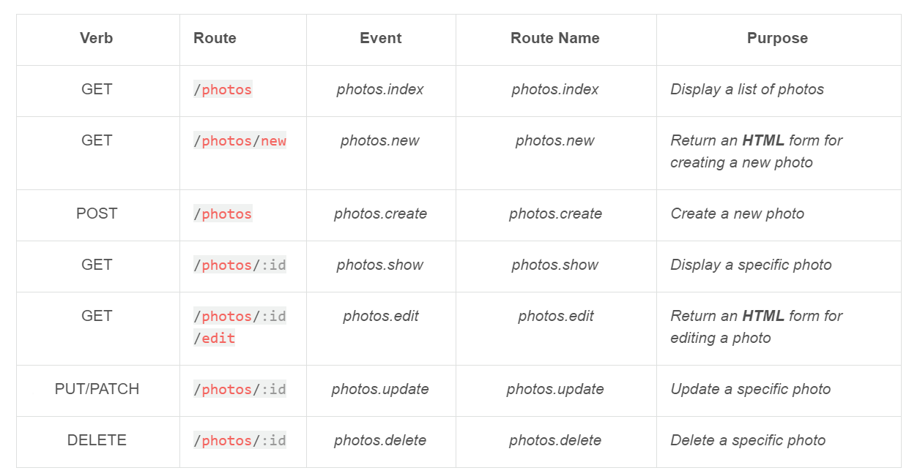

# Automatic REST Crud

In cborm 2.5 we introduced the Base Resource Handler for ORM entities. This base handler will create a nice framework for creating a RESTFul CRUD for your entities based on ColdBox Resources: [https://coldbox.ortusbooks.com/the-basics/routing/routing-dsl/resourceful-routes](https://coldbox.ortusbooks.com/the-basics/routing/routing-dsl/resourceful-routes)

This means that we will create all the boilerplate code to list, show, create, update and delete your entities. Including relationships, validation, population, pagination and different ways to render \(include/exclude\) your data thanks to Mementifier. Get ready to start creating RESTFul services in no time!


You must be using ColdBox 6 for this feature to work


## Settings

To start off with our resources support, you can start by adding the following settings to your config/Coldbox.cfc in the `moduleSettings.cborm` struct:

```javascript
cborm = {
     // Resource Settings
        resources : {
            // Enable the ORM Resource Event Loader
            eventLoader     : false,
            // Pagination max rows
            maxRows         : 25,
            // Pagination max row limit: 0 = no limit
            maxRowsLimit     : 500
        }
}
```

* `eventLoader` : If enabled, upon application startup it will register all the following events for EVERY entity managed by Hibernate
* `maxRows` : By default the cborm resource handler will paginate results, you can choose your pagination window here.
* `maxRowsLimit` : By default it will not allow more than 500 records to be returned from the listing method. However, you can make this 0 or anything you like.

### Registered Events

Once the resource event loader is activated, it will ask Hibernate for all the managed entities and register the following events in ColdBox so you can create interceptors that listen to them:

* `pre{entityName}List`
* `post{entityName}List`
* `pre{entityName}Save`
* `post{entityName}Save`
* `pre{entityName}Show`
* `post{entityName}Show`
* `pre{entityName}Update`
* `post{entityName}Update`
* `pre{entityName}Delete`
* `post{entityName}Delete`

## Define Your Entities

It's time to focus on your entities now. Build out the properties, relationships, methods and make sure you add the mementifier and validation settings so our base handler can use it for validation and for data rendering:


```java
/**
 * Copyright since 2020 by Ortus Solutions, Corp
 * www.ortussolutions.com
 * ---
* A setting object
*/
component
    persistent="true"
    table="setting"{

    /* *********************************************************************
    **                            PROPERTIES
    ********************************************************************* */

    property
        name="settingId"
        fieldtype="id"
        generator="uuid"
        ormtype="string"
        setter="false";

    property
        name="name"
        notnull="true"
        unique="true"
        length="255";

    property
        name="value"
        notnull="true"
        ormtype="text";

    /* *********************************************************************
    **                            PK + CONSTRAINTS
    ********************************************************************* */

    // Validation
    this.constraints ={
        "name"         = { required=true, size="1..255", validator="UniqueValidator@cborm" },
        "value"     = { required=true }
    };

    // Mementofication
    this.memento = {
        defaultIncludes = [ "name", "value" ]
    };

}
```


The mementifier is a critical piece as it will allow you to pass in to the rest service `includes` and `excludes` so you can decide what will be marshalled out of the service.

## Register The Resource

Now that you have finished your entities, you can now register the resources you will be managing. Open your `config/ColdBox.cfc` or your Module's router:


```java
resources( "photos" );
```


This will generate all the resourceful routes as per the ColdBox Resources Routing:



## Create the Handler

Now that your resources are created, create the handler that matches the resource. You can use CommandBox: `coldbox create handler settings` or just create the file manually. Make sure it extends our cborm resource handler: `cborm.models.resources.BaseHandler`

```javascript
/**
 * Manage settings
 */
component extends="cborm.models.resources.BaseHandler"{

    // DI
    property name="ormService" inject="SettingService";

    // The default sorting order string: permission, name, data desc, etc.
    variables.sortOrder     = "name";
    // The name of the entity this resource handler controls. Singular name please.
    variables.entity         = "Setting";

}
```

The Base Handler requires 1 injection and at most two settings for it to work properly:

### ORM Service Injection

You will inject the orm service that will be providing the operations on your RESTFul service, this can be a virtual service a concrete service.

```javascript
// Concrete Service
property name="ormservice" inject="SettingService";
// Virtual
property name="ormservice" inject="entityService:Setting";
```

### Private Properties

You have two private properties you can set:

* `sortOrder` : The default sorting order string: `permission, name, data desc, etc`
* `entity` :  The name of the entity this resource handler controls. Singular name please.

### Generated Actions

The base resource handler will generate the following methods for you that will match the routes that you registered via the `resources()` method.

| Action | HTTP Method | Purpose | Route | Throws |
| :--- | :--- | :--- | :--- | :--- |
| `index()` | GET | List resources | `/{resource}` | none |
| `create()` | POST | Create a resource | `/{resource}` | Validation |
| `show()` | GET | Get one resource | `/{resource}/:id` | EntityNotFound |
| `update()` | PUT/PATCH | Update a resource | `/{resource}/:id` | EntityNotFound, Validation |
| `delete()` | DELETE | Delete a resource | `/{resource}/:id` | EntityNotFound |

### Consistent Output

REST is all about uniformity and consistency. The output packet produced by any of the actions you create or use, will adhere to the following schema:

```javascript
{
    "data": "", // The output of your actions: struct, string, array, etc
    "error": false, // If an error ocurred
    "pagination": { // Pagination information
        "totalPages": 1,
        "maxRows": 25,
        "offset": 0,
        "page": 1,
        "totalRecords": 5
    },
    "messages": [] // Info messages
}
```

### Utility Methods

We also offer you a few utility methods once you start overriding the action methods:

```javascript
/**
 * Calculate the starting offset for the incoming page
 *
 * @page The page to lookup on
 *
 * @return The page start offset
 */
private function getPageOffset( page = 1 )

/**
 * Get the max number of rows to retrieve according to global settings
 * or passed in through RC
 */
private function getMaxRows( event = getRequestContext() )

/**
 * Coverts a value to the correct javaType for the property passed in.
 *
 * @propertyName The property name
 * @value The property value
 */
private function autoCast( required propertyName, required value )

/**
 * Get a brand new criteria builder object
 *
 * @useQueryCaching Activate query caching for the list operations
 * @queryCacheRegion The query cache region to use, which defaults to criterias.{entityName}
 * @defaultAsQuery To return results as queries or array of objects or reports, default is array as results might not match entities precisely
 *
 * @return cborm.models.criterion.CriteriaBuilder
 */
private function newCriteria(
    boolean useQueryCaching = false,
    string queryCacheRegion = "",
    datasource
)
```

## Action Parameters

Each action can take in not only the incoming parameters that your entities require for population and saving, but also we have added a few to help you:

### Index\(\)

| Parameter | Type | Default | Description |
| :--- | :--- | :--- | :--- |
| `includes` | `string` | `empty` | One or a list of properties you want to include in the output packet apart from the default Includes defined in your entity. Adheres to the [mementifier](mementifier.md) |
| `excludes` | `string` | `empty` | One or a list of properties you want to exclude in the output packet apart from the default excludes defined in your entity. Adheres to the [mementifier](mementifier.md) |
| `ignoreDefaults` | `boolean` | `false` | If true, it will ignore all default includes and excludes and ONLY use the includes and excludes you pass. Adheres to the [mementifier](mementifier.md) |
| `sortOrder` | `string` | `variables.sortOrder` | The sort ordering you want to apply to the result set. Adheres to the criteria query [sort\(\) method](../base-orm-service-1/service-methods/criteria-queries/) |
| `page` | `numeric` | `1` | Pagination is included, so you can pass in the page of records you would like to visualize. |

### Create\(\)

| Parameter | Type | Default | Description |
| :--- | :--- | :--- | :--- |
| `includes` | `string` | `empty` | One or a list of properties you want to include in the output packet apart from the default Includes defined in your entity. Adheres to the [mementifier](mementifier.md) |
| `excludes` | `string` | `empty` | One or a list of properties you want to exclude in the output packet apart from the default excludes defined in your entity. Adheres to the [mementifier](mementifier.md) |
| `ignoreDefaults` | `boolean` | `false` | If true, it will ignore all default includes and excludes and ONLY use the includes and excludes you pass. Adheres to the [mementifier](mementifier.md) |

### Show\(\)

| Parameter | Type | Default | Description |
| :--- | :--- | :--- | :--- |
| `includes` | `string` | `empty` | One or a list of properties you want to include in the output packet apart from the default Includes defined in your entity. Adheres to the [mementifier](mementifier.md) |
| `excludes` | `string` | `empty` | One or a list of properties you want to exclude in the output packet apart from the default excludes defined in your entity. Adheres to the [mementifier](mementifier.md) |
| `ignoreDefaults` | `boolean` | `false` | If true, it will ignore all default includes and excludes and ONLY use the includes and excludes you pass. Adheres to the [mementifier](mementifier.md) |
| `id` | `numeric` | `0` | The incoming ID of the resource to show |

### Update\(\)

| Parameter | Type | Default | Description |
| :--- | :--- | :--- | :--- |
| `includes` | `string` | `empty` | One or a list of properties you want to include in the output packet apart from the default Includes defined in your entity. Adheres to the [mementifier](mementifier.md) |
| `excludes` | `string` | `empty` | One or a list of properties you want to exclude in the output packet apart from the default excludes defined in your entity. Adheres to the [mementifier](mementifier.md) |
| `ignoreDefaults` | `boolean` | `false` | If true, it will ignore all default includes and excludes and ONLY use the includes and excludes you pass. Adheres to the [mementifier](mementifier.md) |
| `id` | `numeric` | `0` | The incoming ID of the resource to show |

### Delete\(\)

| Parameter | Type | Default | Description |
| :--- | :--- | :--- | :--- |
| `id` | `numeric` | `0` | The incoming ID of the resource to show |

## Overriding Actions

You can also override the actions we give you so you can spice them up as you see fit. A part from calling the super class to finalize your REST call, we have allso added some extra arguments to your base actions so you can have fine-grained control of populations, validations, querying and much more.

```javascript
/**
 * Display all clientNotes by creating my own criteria object
 * GET /api/v1/clientNotes
 *
 * @override
 */
function index( event, rc, prc ){
    // Criterias and Filters
    param rc.sortOrder             = "createdDate desc";
    param rc.page                 = 1;
    param rc.isActive             = true;
    param rc.clientId             = "";
    param rc.creatorId             = "";

    // Build up a search criteria and let the base execute it
    arguments.criteria = newCriteria()
        .eq( "isActive", autoCast( "isActive", rc.isActive )  )
        .when( len( rc.clientId ), (c) => {
            c.eq( "client.clientId", rc.clientId );
        } )
        .when( len( rc.creatorId ), (c) => {
            c.eq( "creator.userId", rc.creatorId );
        } );

    super.index( argumentCollection=arguments );
}

/**
 * Display all employees using my own orm service search which
 * must return a struct of 
 * - count : The number of records
 * - records : The array of objects
 * GET /api/v1/employees
 *
 * @override
 */
function index( event, rc, prc ){
    // Criterias and Filters
    param rc.search             = "";
    param rc.sortOrder             = "lname";
    param rc.page                 = 1;
    param rc.isActive             = true;
    param rc.hasPayroll         = false;
    param rc.managerId             = "";
    param rc.roleId                = "";

    // search
    arguments.results = variables.ormService.search(
        "searchTerm"    = rc.search,
        "sortOrder"     = rc.sortOrder,
        "isActive"        = rc.isActive,
        "hasPayroll"    = rc.hasPayroll,
        "roleId"        = rc.roleId,
        "managerId"        = rc.managerId,
        "offset"         = getPageOffset( rc.page ),
        "max"             = getMaxRows()
    );

    // response
    super.index( argumentCollection=arguments );
}
```

### index\(\) Arguments

<table>
  <thead>
    <tr>
      <th style="text-align:left">Parameter</th>
      <th style="text-align:left">Type</th>
      <th style="text-align:left">Default</th>
      <th style="text-align:left">Description</th>
    </tr>
  </thead>
  <tbody>
    <tr>
      <td style="text-align:left"><code>criteria</code>
      </td>
      <td style="text-align:left"><code>Criteria</code>
      </td>
      <td style="text-align:left"><code>null</code>
      </td>
      <td style="text-align:left">You can pass your own criteria object that we will use to execute to retrieve
        the records</td>
    </tr>
    <tr>
      <td style="text-align:left"><code>results</code>
      </td>
      <td style="text-align:left"><code>struct</code>
      </td>
      <td style="text-align:left"><code>{ count:0, records:[] }</code>
      </td>
      <td style="text-align:left">
        <p>If you pass in a results struct, then you did the search and we will just
          marshall the results using pagination. The struct must contain the following:</p>
        <ul>
          <li><code>count :</code> The records found</li>
          <li><code>records</code> : The array of entities</li>
        </ul>
      </td>
    </tr>
  </tbody>
</table>

### create\(\) Arguments

| Parameter | Type | Default | Description |
| :--- | :--- | :--- | :--- |
| `populate` | `struct` | `{}` | The arguments you want to send into the `populateModel()` method alongside the entity that's being created. |
| `validate` | `struct` | `{}` | The arguments you want to send into the `validateOrFail()` method alongside the entity that's being validated. |

### update\(\) Arguments

| Parameter | Type | Default | Description |
| :--- | :--- | :--- | :--- |
| `populate` | `struct` | `{}` | The arguments you want to send into the `populateModel()` method alongside the entity that's being updated. |
| `validate` | `struct` | `{}` | The arguments you want to send into the `validateOrFail()` method alongside the entity that's being updated. |

Happy Coding!

