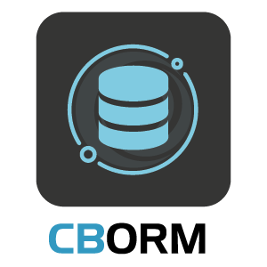
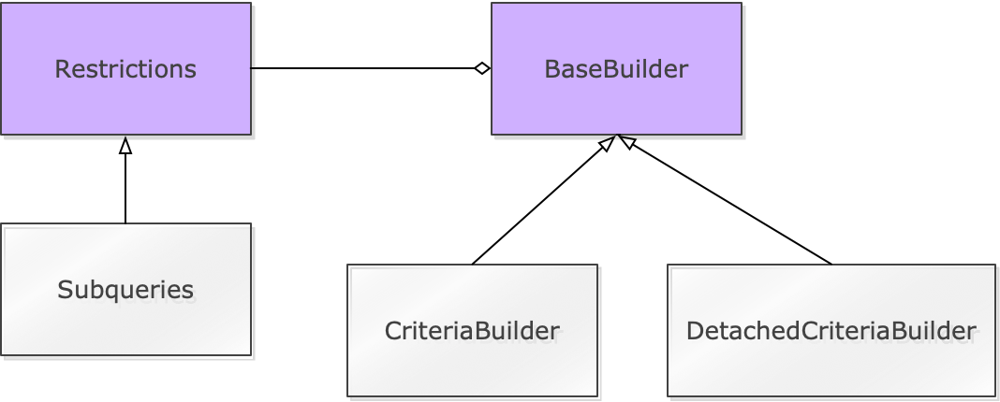

# Introduction

The `cborm` module **enhances** your experience with the BoxLang ORM, powered by the [bx-orm](https://forgebox.io/view/bx-orm) module and [Hibernate](https://hibernate.org/). It adds service layers, active record, dynamic finders and a fluent criteria builder on top of the ORM, and gives you a human approach to working with Hibernate. Basically making working with Hibernate not SUCK!


**cborm 6** is a pure BoxLang module built on `bx-orm` 2 (Hibernate 7). CFML applications run on BoxLang through the `bx-compat-cfml` module. If you run Adobe ColdFusion or Lucee, stay on the cborm 5.x series. See [What's New With 6.0.0](intro/release-history/whats-new-with-6.0.0.md) and [Upgrading to 6](intro/release-history/upgrading-to-6.md).





## Features

* **Service Layers** with all the methods you could probably think of to help you get started in any project
* **Virtual service layers** so you can create virtual services for any entity in your application
* Automatic RESTFul resources handler, focus on your domain objects and business logic, not the boilerplate of REST
* `ActiveEntity` our implementation of Active Record for ORM
* Fluent queries via the bx-orm criteria builder (`newCriteria()`), with cborm's method names, restrictions, subqueries, projections and an SQL log
* Automatic transaction demarcation for save and delete operations, riding BoxLang `transaction{}` blocks
* Dynamic finders and counters for expressive and fluent shorthand queries
* Case-insensitive entity and property names in HQL, criteria and dynamic finders
* Automatic value conversion: bx-orm converts values to the right Java types for you
* Entity population from json, structs, xml, and queries including building up their relationships
* Entity validation via [cbValidation](https://forgebox.io/view/cbvalidation)
* Includes the [Mementifier project](https://www.forgebox.io/view/mementifier) to produce memento states from any entity, great for producing JSON
* Finders and queries can return native Java streams that read from the database as they are consumed

```javascript
// A quick preview of some functionality
book = new Book().findByTitle( "My Awesome Book" );
book = new Book().getOrFail( 2 );
new Book().getOrFail( 4 ).delete();
new Book().deleteWhere( isActive:false, isPublished:false );

// Inject Virtual Entity Services
property name="userService" inject="entityService:User";

// Listing Capabilities
userService.list();
userService.list( asStream=true );

// Counting and dynamic finders
count = userService.countWhere( age:20, isActive:true );
users = userService.findAllByLastLoginBetween( "01/01/2019", "05/01/2019" );

// Criteria Queries
userService
    .newCriteria()
    .eq( "name", "luis" )
    .isTrue( "isActive" )
    .getOrFail();

userService
    .newCriteria()
    .isTrue( "isActive" )
    .joinTo( "role" )
        .eq( "name", "admin" )
    .list();

userService
    .newCriteria()
    .withProjections( property="id,firstName:fname,lastName:lname,age" )
    .isTrue( "isActive" )
    .joinTo( "role" )
        .eq( "name", "admin" )
    .asStruct()
    .list();
```

**In other words, it makes using an ORM not SUCK!**

## Versioning

The ColdBox ORM Module is maintained under the [Semantic Versioning](http://semver.org) guidelines as much as possible.Releases will be numbered with the following format:

```bash
<major>.<minor>.<patch>
```

And constructed with the following guidelines:

* Breaking backward compatibility bumps the major (and resets the minor and patch)
* New additions without breaking backward compatibility bumps the minor (and resets the patch)
* Bug fixes and misc changes bumps the patch

## License

Apache 2 License: [http://www.apache.org/licenses/LICENSE-2.0](http://www.apache.org/licenses/LICENSE-2.0)

## Important Links

* **Code**: [https://github.com/coldbox-modules/cborm](https://github.com/coldbox-modules/cborm)
* **Issues**: [https://ortussolutions.atlassian.net/browse/CBORM](https://ortussolutions.atlassian.net/browse/CBORM)
* **ForgeBox**: [https://forgebox.io/view/cborm](https://forgebox.io/view/cborm)

## Discussion & Help



The Ortus Community is the way to get any type of help for our entire platform and modules: [https://community.ortussolutions.com](https://community.ortussolutions.com)

## Professional Open Source


The ColdBox ORM Module is a professional open source software backed by [Ortus Solutions, Corp](http://www.ortussolutions.com/services) offering services like:

* Custom Development
* Professional Support & Mentoring
* Training
* Server Tuning
* Security Hardening
* Code Reviews
* [Much More](http://www.ortussolutions.com/services)

### HONOR GOES TO GOD ABOVE ALL

Because of His grace, this project exists. If you don't like this, then don't read it, it's not for you.

> "Therefore being justified by **faith**, we have peace with God through our Lord Jesus Christ: By whom also we have access by **faith** into this **grace** wherein we stand, and rejoice in hope of the glory of God." Romans 5:5
